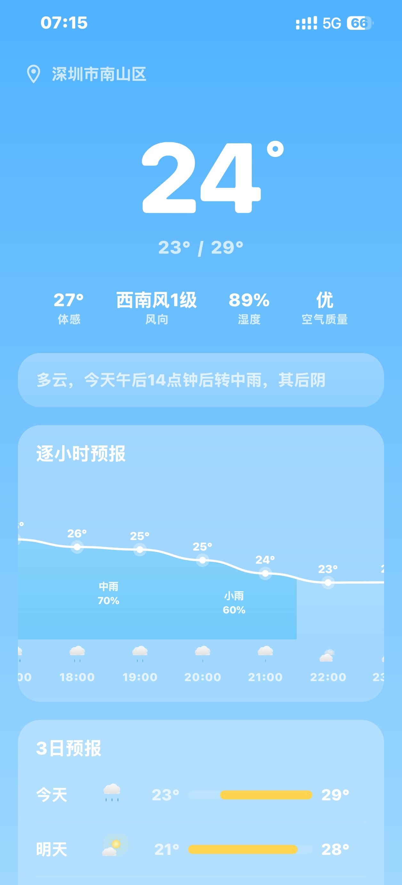

# SkyPulse AI Weather

**Android + HarmonyOS 原生双端 AI 天气应用**

[下载 v4.0.0](https://github.com/leoguo1314/weather-none/releases/tag/v4.0.0) · [Android 源码](app) · [HarmonyOS 源码](harmony)

---

## 项目简介

SkyPulse 是一款同时支持 Android 与 HarmonyOS 的天气应用。Android 端基于 Kotlin、Jetpack Compose 与 MVVM 架构；HarmonyOS 端使用原生 ArkTS + ArkUI 开发，不是 Android APK 的兼容层封装。

v4.0.0 新增 AI Weather Agent，可结合实时天气、逐时/逐日趋势、空气质量、天气预警、穿衣与出行风险给出自然语言建议。

## 功能亮点

| 能力 | Android | HarmonyOS |
|---|---|---|
| 实时天气 | 温度、湿度、风、气压、能见度、AQI | 温度、体感、湿度、风速 |
| 天气预报 | 48 小时、15 天 | 7 天 |
| 城市能力 | GPS 定位、多城市管理 | 城市搜索与切换 |
| AI 天气助手 | 本地 Agent；可选 OpenAI/OneAPI/Ollama 兼容模型 | 免 Key 本地 Weather Agent |
| 数据源 | 彩云天气及项目配置的天气服务 | Open-Meteo 免 Key 接口 |
| 原生 UI | Jetpack Compose + Material 3 | ArkUI |
| 系统要求 | Android 8.0 / API 26 及以上 | HarmonyOS 6.0 / API 20 及以上，兼容 HarmonyOS 7 |

> Android 外部大模型为可选配置；不配置 API Key 时，天气与本地 AI 建议仍可使用。模型连接失败会回退到本地 Agent。

## 下载

当前稳定版本：[v4.0.0 Release](https://github.com/leoguo1314/weather-none/releases/tag/v4.0.0)

| 文件 | 用途 | 能否直接安装 |
|---|---|---|
| [skypulse-v4.0.0.apk](https://github.com/leoguo1314/weather-none/releases/download/v4.0.0/skypulse-v4.0.0.apk) | Android 8.0+ 手机 | 可以 |
| [skypulse-harmony-v4.0.0-openharmony-signed.hap](https://github.com/leoguo1314/weather-none/releases/download/v4.0.0/skypulse-harmony-v4.0.0-openharmony-signed.hap) | OpenHarmony 开发设备或兼容模拟器 | 仅适用于接受该自签证书的设备 |
| [skypulse-harmony-v4.0.0-unsigned.hap](https://github.com/leoguo1314/weather-none/releases/download/v4.0.0/skypulse-harmony-v4.0.0-unsigned.hap) | 华为开发者重新签名的输入包 | 不可以，必须先签名 |

Release 同时提供 SHA-256 文件，可在安装前核对包体完整性。

## Android 手机安装

1. 下载 [skypulse-v4.0.0.apk](https://github.com/leoguo1314/weather-none/releases/download/v4.0.0/skypulse-v4.0.0.apk)。
2. 在系统设置中允许浏览器或文件管理器“安装未知应用”。
3. 打开 APK，按系统提示完成安装。
4. 首次启动后授予定位权限；如果不授权，也可以手动添加城市。

如果系统提示“与已安装应用签名不一致”，需要先卸载旧签名版本再安装。卸载会清除该应用的本地数据，请先确认是否需要保留原配置。

## HarmonyOS 6.0 / 7.0 手机安装

### 先了解 HAP 签名限制

华为零售版 HarmonyOS 真机不能像 Android APK 一样直接安装通用自签 HAP。真机调试要求 HAP 使用与你的华为开发者账号、应用和目标设备匹配的调试证书与 Profile 签名。

因此：

- **openharmony-signed.hap** 主要用于 OpenHarmony 开发设备或接受该证书的模拟器，通常不能直接安装到华为零售手机。
- **unsigned.hap** 只是重新签名的输入包，不能直接点击安装。
- 在 HarmonyOS 6.0/7.0 华为手机上，推荐打开本仓库的 **harmony/** 工程，让 DevEco Studio 自动签名、安装并启动。

华为官方也明确说明：模拟器/预览器不需要签名，HarmonyOS 真机调试必须签名；单台调试设备建议使用 DevEco Studio 自动签名。

### 推荐方式：DevEco Studio 自动签名并安装

#### 1. 准备环境

- HarmonyOS 6.0 或 7.0 手机。
- 最新版 [DevEco Studio](https://developer.huawei.com/consumer/cn/deveco-studio/)。
- 已注册并实名认证的华为开发者账号。
- USB 数据线；手机已开启开发者模式和 USB 调试。

#### 2. 获取并打开工程

~~~bash
git clone https://github.com/leoguo1314/weather-none.git
cd weather-none
~~~

在 DevEco Studio 中选择 **Open**，打开仓库中的 **harmony** 目录，等待 SDK 和 OHPM 依赖同步完成。

项目当前配置：

- bundleName：**com.skypulse.weather.harmony**
- 编译 SDK：HarmonyOS 6.1.1 / API 24
- 目标与最低兼容 SDK：HarmonyOS 6.0.0 / API 20
- 设备类型：phone、tablet、2in1

#### 3. 连接手机

1. 在手机上开启开发者模式和 USB 调试。
2. 使用 USB 连接电脑，在手机弹窗中允许 USB 调试。
3. 在 DevEco Studio 顶部设备列表中确认手机已出现。
4. 也可以在 DevEco Studio Terminal 中检查：

~~~bash
hdc list targets
~~~

#### 4. 配置自动签名

1. 登录 DevEco Studio 中的华为开发者账号。
2. 打开 **File > Project Structure > Project > Signing Configs**。
3. 勾选 **Automatically generate signature**，等待证书和设备调试 Profile 自动生成。
4. 点击 **OK** 保存。

如果提示 bundleName 已被其他开发者占用，请将 [harmony/AppScope/app.json5](harmony/AppScope/app.json5) 中的 **bundleName** 改为你账号下唯一的反向域名，例如 **com.yourname.skypulse.weather**，然后重新执行自动签名。

#### 5. 安装并运行

1. 在运行配置中选择 **entry** 模块。
2. 在设备列表中选择已连接的 HarmonyOS 手机。
3. 点击 **Run**。
4. DevEco Studio 会自动构建已签名 HAP、安装到手机并启动应用。

这是华为零售版 HarmonyOS 6.0/7.0 手机最稳妥的安装方式。

### 命令行安装已正确签名的 HAP

只有当 HAP 已使用与你的设备匹配的证书和 Profile 签名后，才可以执行：

~~~bash
hdc list targets
hdc install -r /absolute/path/to/skypulse-signed.hap
~~~

**-r** 表示覆盖安装。签名不匹配时仍会安装失败；此时应回到 DevEco Studio 重新自动签名，而不是尝试安装 Release 中的未签名包。

### HarmonyOS 常见问题

| 提示或现象 | 原因 | 处理方法 |
|---|---|---|
| signature verification failed / 签名校验失败 | HAP 证书或 Profile 与设备不匹配 | 使用 DevEco Studio 自动签名后重新 Run |
| install parse profile failed | 使用了未签名 HAP，或 Profile 无效 | 不要直接安装 **unsigned.hap** |
| bundleName 已存在或无权限 | 应用标识不属于当前开发者账号 | 修改 **harmony/AppScope/app.json5** 中的 bundleName |
| DevEco Studio 找不到手机 | USB 调试未开启、未授权或线缆异常 | 重新连接并确认手机授权，使用 **hdc list targets** 检查 |
| 已有同包名应用但签名不同 | 手机上残留其他证书签名的版本 | 卸载旧版后再安装；注意本地数据会被清除 |
| 打开后无法刷新天气 | 网络不可用或 Open-Meteo 暂时不可达 | 检查网络后重试 |

官方参考：[应用开发准备与签名](https://developer.huawei.com/consumer/cn/doc/HarmonyOS-Guides/application-dev-overview) · [配置调试签名](https://developer.huawei.com/consumer/cn/doc/harmonyos-guides/ide-signing) · [HDC 调试命令](https://developer.huawei.com/consumer/cn/doc/harmonyos-guides/hdc)

## 从源码构建

### Android

要求：JDK 17、Android SDK 35。

~~~bash
git clone https://github.com/leoguo1314/weather-none.git
cd weather-none
./gradlew testDebugUnitTest assembleDebug
~~~

APK 输出目录：

~~~text
app/build/outputs/apk/debug/
~~~

如需 GPS 反向地理编码或自定义天气服务，在 **local.properties** 中配置对应 Key；不要把私钥提交到 Git。

### HarmonyOS

要求：DevEco Studio、HarmonyOS 6.1.1 SDK / API 24、OHPM、Hvigor。

~~~bash
cd harmony
ohpm install --all
hvigorw assembleHap --mode module -p product=default -p module=entry@default -p buildMode=debug --no-daemon
~~~

HAP 默认输出目录：

~~~text
harmony/entry/build/default/outputs/default/
~~~

命令行构建若未配置 **signingConfigs**，输出的是未签名 HAP，不能安装到华为零售真机。真机安装请使用上面的 DevEco Studio 自动签名流程。

## AI Weather Agent

Android Agent 会根据用户问题选择并组合天气工具：

- 当前天气与体感
- 小时/每日趋势
- 空气质量
- 灾害预警
- 穿衣建议
- 出行风险

Android 端支持配置 OpenAI API 兼容服务，包括常见的 OneAPI 或本地 Ollama 网关。API Key 在设备端加密保存；未配置或调用失败时使用本地规则推理。

HarmonyOS 端提供无需模型 Key 的本地 Weather Agent，结合 Open-Meteo 实时天气和 7 日预报生成趋势、穿衣与出行建议。

## 工程结构

~~~text
weather-none/
├── app/           Android 应用：Kotlin + Jetpack Compose
├── agent-core/    Android AI Agent 核心接口与模型
├── harmony/       HarmonyOS 应用：ArkTS + ArkUI
├── mcp-tools/     天气工具与 MCP 相关模块
├── scripts/       构建/发布辅助脚本
└── .github/
    └── workflows/ Android + HarmonyOS CI 构建与 Release
~~~

## 构建验证

GitHub Actions 会执行：

- Android 单元测试与 Debug APK 构建
- HarmonyOS ArkTS 类型检查与 HAP 构建
- HAP 自签名、ZIP 完整性和 SHA-256 校验
- Release 上传后重新下载并逐字节比对

查看：[Build Android and HarmonyOS packages](https://github.com/leoguo1314/weather-none/actions/workflows/build-mobile.yml)

## 致谢

本项目基于 [qnmlgbd250/weather-none](https://github.com/qnmlgbd250/weather-none) 扩展，新增 AI Weather Agent 与 HarmonyOS 原生工程。
